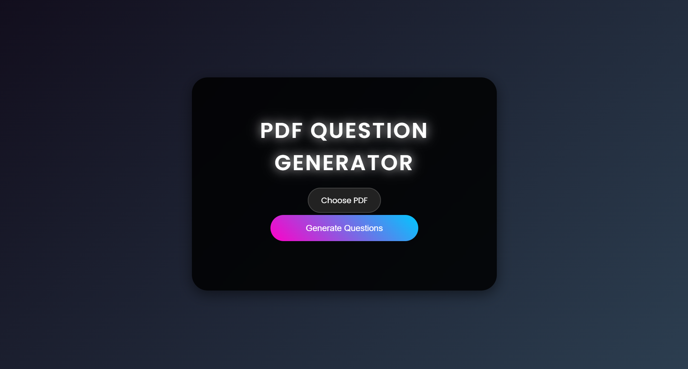

# twise-ai-quiz

# Quiz Generator App

This application generates quizzes from PDF files using the Gemini Pro API. It classifies the text within the PDF and creates quiz questions in three categories: Multiple Choice Questions (QCM), Yes/No Questions (Oui/Non), and Short Answer Questions (Courte réponse).

 

## Installation

1.  **Clone the Repository:**
    ```bash
    git clone https://github.com/ITSHAYDER/twise-ai-quiz/tree/main
    cd YOUR_REPO_NAME
    ```

2.  **Create a Virtual Environment (Recommended):**
    ```bash
    python3 -m venv venv  # Create a virtual environment
    source venv/bin/activate  # Activate the environment (Linux/macOS)
    venv\Scripts\activate  # Activate the environment (Windows)
    ```

3.  **Install Requirements:**
    ```bash
    pip install -r requirements.txt
    ```
    The `requirements.txt` file should contain the following packages:
    ```
    flask
    google-generativeai
    PyMuPDF
    flask-cors
    ```

## Usage

1.  **Set API Key:**
    *   Open the `main.py` file.
    *   Replace `""` with your actual Gemini Pro API key.  You can obtain an API key from the Google Cloud Console.

2.  **Run the Flask App:**
    ```bash
    python main.py
    ```
    This will start the Flask development server.  You'll typically see output like:
    ```
     * Serving Flask app "main" (lazy loading)
     * Environment: development
     * Debug mode: on
     * Running on [http://127.0.0.1:5000/](http://127.0.0.1:5000/) (Press CTRL+C to quit)
    ```

3.  **Access the Application:**
    *   Open your web browser and go to the URL provided in the terminal (usually `http://127.0.0.1:5000/`).  This should display the index page of the application.

4.  **Generate a Quiz:**
    *   On the index page, you should find a file upload form.
    *   Select a PDF file that you want to use to generate the quiz.
    *   Click the "Submit" or "Generate Quiz" button.
